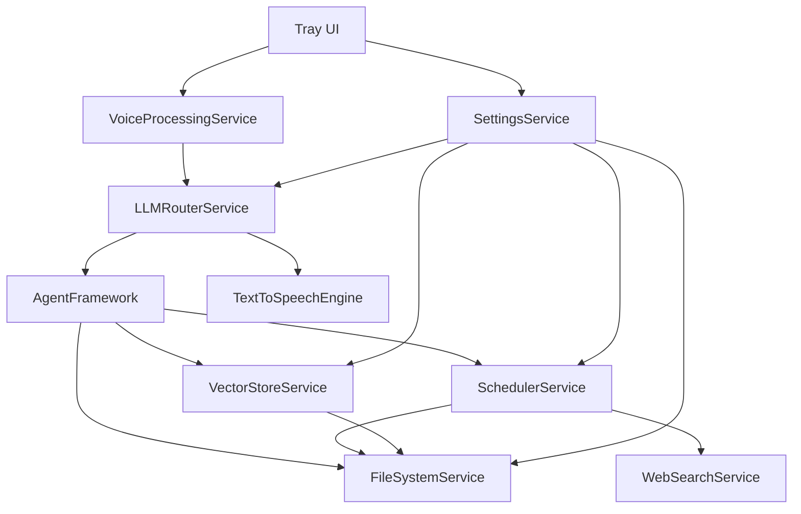

# Cindy - Core Modules and Interactions

## Module Breakdown

### 1. Voice Processing Module

**Components:**
- WakeWordDetector: Listens for activation phrase
- SpeechToTextEngine: Converts voice to text
- TextToSpeechEngine: Converts text to voice

**Dependencies:**
- SettingsService (for activation phrase, voice settings)
- LLMRouterService (to send transcribed text)

**Interfaces:**
```typescript
interface VoiceProcessingService {
  startListening(): Promise<void>;
  stopListening(): Promise<void>;
  isListening(): boolean;
  setActivationPhrase(phrase: string): void;
  onWakeWord(callback: () => void): void;
  onSpeechTranscribed(callback: (text: string) => void): void;
  speak(text: string): Promise<void>;
}
```

### 2. LLM Router Module

**Components:**
- OpenAIProvider: Connects to OpenAI API
- OllamaProvider: Connects to local Ollama service
- ModelSelector: Switches between providers

**Dependencies:**
- SettingsService (for API keys, model preferences)
- ToolExecutor (to run agent tools)
- TextToSpeechEngine (for voice responses)

**Interfaces:**
```typescript
interface LLMRouterService {
  setProvider(provider: 'openai' | 'ollama'): void;
  sendMessage(message: string, context?: any): AsyncGenerator<string>;
  isOnline(): boolean;
}
```

### 3. Agent Framework Module

**Components:**
- ConversationManager: Tracks conversation state
- ToolExecutor: Runs agent tools
- MemoryManager: Persists state across sessions

**Dependencies:**
- LLMRouterService (for AI interactions)
- VectorStoreService (for knowledge retrieval)
- FileSystemService (for file operations)

**Interfaces:**
```typescript
interface AgentFramework {
  startConversation(): void;
  continueConversation(message: string): Promise<void>;
  executeTool(toolName: string, parameters: any): Promise<any>;
  getCurrentContext(): ConversationContext;
}
```

### 4. Vector Store Module

**Components:**
- VectorDatabase: Embedded vector store
- IndexManager: Manages content indexing
- SearchEngine: Semantic search capabilities

**Dependencies:**
- FileSystemService (for vault access)
- SchedulerService (for index updates)

**Interfaces:**
```typescript
interface VectorStoreService {
  indexVaultContent(vaultPath: string): Promise<void>;
  search(query: string, limit?: number): Promise<SearchResult[]>;
  addDocument(document: Document): Promise<void>;
  removeDocument(id: string): Promise<void>;
}
```

### 5. File System Module

**Components:**
- VaultManager: Manages markdown files
- FileOperations: Safe read/write operations
- CitationGenerator: Creates source citations

**Dependencies:**
- SettingsService (for vault path)
- VectorStoreService (for indexing)

**Interfaces:**
```typescript
interface FileSystemService {
  setVaultPath(path: string): void;
  createNote(title: string, content: string): Promise<string>;
  editNote(noteId: string, content: string, range?: [number, number]): Promise<void>;
  searchNotes(query: string): Promise<Note[]>;
  getNote(noteId: string): Promise<Note>;
}
```

### 6. Scheduler Module

**Components:**
- TaskQueue: Manages research tasks
- WebResearcher: Performs automated research
- ReportGenerator: Creates markdown reports

**Dependencies:**
- SettingsService (for schedule preferences)
- FileSystemService (for saving reports)
- WebSearchService (for research)

**Interfaces:**
```typescript
interface SchedulerService {
  scheduleResearch(topic: string, interval: string): void;
  runResearch(topic: string): Promise<void>;
  getSchedule(): ScheduledTask[];
  cancelTask(taskId: string): void;
}
```

### 7. Settings Module

**Components:**
- ConfigManager: Manages user preferences
- SecurityManager: Handles secrets encryption
- PlatformAdapter: Cross-platform settings storage

**Dependencies:**
- None (this is a base service)

**Interfaces:**
```typescript
interface SettingsService {
  get<T>(key: string, defaultValue?: T): T;
  set<T>(key: string, value: T): void;
  getAll(): Record<string, any>;
  save(): Promise<void>;
}
```

## Module Interactions



## Data Flow Examples

### Voice Conversation Flow:
1. Tray UI initializes VoiceProcessingService
2. VoiceProcessingService listens for wake word via WakeWordDetector
3. On detection, SpeechToTextEngine transcribes speech
4. LLMRouterService sends text to selected provider
5. AgentFramework processes response and may execute tools
6. TextToSpeechEngine converts response to speech

### Research Task Flow:
1. SchedulerService queues research task based on schedule
2. WebResearcher uses WebSearchService to gather information
3. ReportGenerator creates markdown with citations via FileSystemService
4. VectorStoreService indexes new content
5. SettingsService updates task status

### File Operations Flow:
1. AgentFramework requests file operation through ToolExecutor
2. FileSystemService performs safe operations within vault
3. VectorStoreService updates index for changed content
4. SettingsService persists any configuration changes